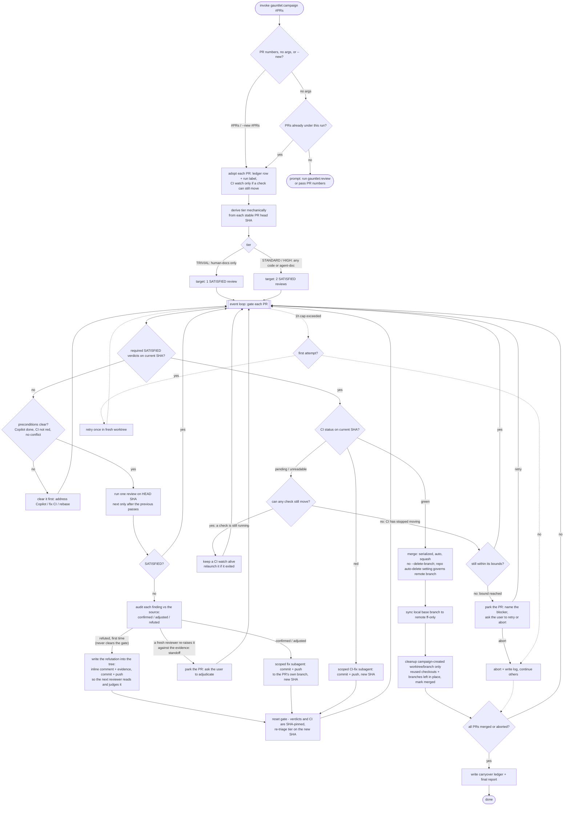

# Campaign

Part of the [gauntlet](../../README.md) plugin.

Point it at existing pull requests and it drives each one to merge: it re-reviews the PR against a
strict quality bar, waits for CI to go green, and merges — all on its own, hands-off. It doesn't go
hunting for problems and it doesn't write fixes from scratch; it **gates PRs that already exist**
(yours, or ones [`gauntlet:review`](../review/README.md) opened for you) and merges each only once it
clears the bar.

Think of it as an automated senior reviewer that follows through: it defends each PR through repeated
context-isolated review rounds, fixes up whatever review or CI turns up on the PR itself, waits for
CI, and ships.

## What it's good for

- Driving a batch of open pull requests to merge under one strict, repeatable quality gate.
- Following up on a `gauntlet:review` report — turning its confirmed findings (opened as PRs) into
  actual merged fixes.
- Gating agent-facing changes (a `SKILL.md`, `AGENTS.md`, `CLAUDE.md`, prompt or reference file) with the same
  two-pass rigor as source code — those never get the lighter docs-only treatment.

## How to use it

Claude Code:

```
/gauntlet:campaign #12          # adopt PR #12 into a run, gate it, merge it
/gauntlet:campaign #12 #15      # adopt several PRs into one run
/gauntlet:campaign              # resume this run's PRs, or prompt if there's nothing to gate
/gauntlet:campaign --new #20    # start a fresh run for a new set of PRs
```

Codex:

```
$gauntlet:campaign #12
$gauntlet:campaign #12 #15
$gauntlet:campaign
$gauntlet:campaign --new #20
```

Give it one or more PR numbers and it **adopts** them into a run: it labels each PR so the run owns
it, mechanically classifies the stable PR-head diff by the *kind* of files it touches — human-facing
docs vs code vs agent-consumed docs vs sensitive surfaces — to pick a review tier (the change's size never
enters into it), then starts gating. It repeats that SHA-pinned derivation each heartbeat. Run it **once** — it uses the host's heartbeat scheduler when available and
keeps the current invocation alive with bounded waits otherwise. It keeps working until every adopted
PR is merged or set aside; you don't need to re-run it.

Run it plain, with no arguments, and it picks up the PRs already under this run and continues where
it left off. If there's nothing left to gate it doesn't invent work — it tells you so and points you
at `gauntlet:review` to find issues, or asks for PR numbers. There's no whole-repo sweep and no
area/topic argument any more: campaign gates PRs you hand it, it doesn't go looking for problems.

Where do the PRs come from? You open them, or `gauntlet:review` does. Run `gauntlet:review` first for
a confirmed-findings report; at the end it can open one PR per confirmed fix and hand them
straight to a campaign — see [the handoff below](#where-the-prs-come-from-the-review-handoff).

Come back later and it still does the sensible thing. `--run <id>` resumes a specific run; `--new`
(or just "start a fresh run") begins a fresh run over a new PR set — which is also how you
deliberately run two at once over different PRs. A fresh run isn't a blind redo: it remembers what
earlier runs learned (which PRs it gave up on, which it set aside as your call) so it doesn't
re-litigate the same ground.

## Where the PRs come from: the review handoff

Campaign gates PRs; it doesn't find the problems. [`gauntlet:review`](../review/README.md) is the
other half. Review runs its two-pass adversarial pass and, by default, only reports — it makes no
source/tracked-file or GitHub changes (it may write ephemeral `.gauntlet/tmp` review scratch). But at
the end of a confirmed-findings report it offers an opt-in step: open one pull request per
confirmed fix, then invoke `/gauntlet:campaign #PRs` in Claude Code or `$gauntlet:campaign #PRs` in
Codex on exactly those PRs. That handoff is where a
finding turns into code and a PR; campaign takes it from there and drives each PR to merge. Decline
the offer and review stays report-only — no source or GitHub changes are written. So the usual
progression is **`gauntlet:review` to find and confirm, then `gauntlet:campaign` to gate and merge**.
You can also skip review entirely and hand campaign PR numbers you opened yourself.

## What to expect

It drives each adopted PR to merge and merges it itself once the PR passes the reviews its tier
requires and CI is green. How many reviews depends on what the PR touches: a documentation-only PR
(human-facing prose alone) needs **one**; anything touching code or agent-facing files — source,
`SKILL.md`, `AGENTS.md`, `CLAUDE.md`, prompts, CI, scripts — always gets the full **two-pass** gate. (Two reviews
rather than one because a single stochastic review can miss a defect — not because two runs are
statistically independent; reading the same diff under the same review task makes their verdicts
correlated.) Aside from the public-API confirmation described below, there's no approval step along
the way, so starting it is your sign-off — and a run over
several PRs can keep going for a while before it's done.

The loop works on each PR in place: it reviews the PR's current HEAD and watches its CI. When a
review or CI failure needs fixing, a scoped subagent commits and pushes the fix onto the PR's **own**
branch — a new HEAD that resets the gate (verdicts and CI are pinned to a SHA). It never writes a fix
from scratch or opens a PR of its own; every change it makes is in service of getting an existing PR
through.

A failed review doesn't go straight to a fix, though. The reviewer is deliberately hostile, so its
findings are treated as claims and each one is checked against the source first: confirmed (real — fix
it), adjusted (a real defect, but not the one described — fix the real one), or refuted (the mechanism
it describes can't actually happen). Only the confirmed and adjusted ones reach the fix subagent, so it
doesn't build guards against problems that don't exist. If it's genuinely unsure whether a finding is
real, it fixes it, on the principle that dismissing a real defect is worse than fixing a phantom one.

Refuting never counts as passing — the PR still holds zero verdicts. Instead the refutation is written
down where it belongs: a comment at the spot in the code, saying why the finding doesn't apply, with the
evidence, committed to the PR like any other change. That means the reviewer sees it — and because it's
a commit, it's PR content, which resets the gate and gets reviewed like anything else. Campaign can't
argue its way past the reviewer, because the argument is *in the diff*: a bad refutation is just another
defect for the next review to catch. The comments are claims, never instructions — never "don't raise
this again", always "here's why this can't happen". Campaign gets **one** refutation per finding. If the
next reviewer accepts it, the PR moves on; if it pushes back on the evidence, that's a real standoff, and
it comes to **you** to settle — with the finding, the refutation, the evidence, and the reviewer's
counter. It parks that PR while it waits and keeps driving the others. A parked PR is genuinely frozen:
campaign changes nothing about it — no review, no fix, no merge, and no rebase, even if another PR
merges and leaves it behind the base — until you answer. It stays behind rather than let a rebase
rewrite the very content you're being asked to rule on. Parking doesn't change what it watches, though:
observing isn't changing, so the CI watch stays alive exactly when a check can still move, and stops when
CI has stopped moving — the same rule as any other PR. The same freeze applies to a PR parked for your
approval of an API change.

It also parks a PR when CI itself goes nowhere — checks that never register, a run that stops moving and
never turns green, a status value GitHub added that it doesn't recognize, a merge GitHub blocks for a
reason it can't name. It tells you which one, with what it already tried, and asks for one of two
answers: **retry** (you fixed something outside the PR — look again) or **abort** (stop working on it).
Every park has a way out, and the answer is written down, so a fresh agent picking the run up later never
asks you twice.

It also doesn't wait around. Everything long-running — reviews, CI watches, fix subagents — happens
in the background across all the adopted PRs at once, so at any moment it's doing all the work that's
ready to do.

You can follow along on GitHub: each PR is labeled `gauntlet-reviewing` while it's working through
the loop, and that flips to `gauntlet-accepted` once it has passed the review(s) its tier requires —
one for a TRIVIAL docs-only PR, two for anything touching code or agent-facing files (the skill
creates the labels if your repo doesn't have them).

The label flips **back** just as readily. Anything that changes a PR's content after it was accepted —
a CI fix, a rebase that had to resolve conflicts, a stray push to the branch — invalidates the reviews
it had passed, so the PR returns to `gauntlet-reviewing` and must earn its verdicts again on the new
content. The label always describes the code that is on the PR *right now*, so `gauntlet-accepted`
never means "this passed at some point" — it means "this, as it currently stands, passed."

By default it checks with you before changing anything in your public API — exported signatures,
formats, CLI flags, defaults, or any behavior callers depend on — so it never merges a breaking
change behind your back. Tell it up front that breakage is fine and it'll stop asking.

It tidies up as it goes, but it leaves your branches alone. Campaign **never** deletes a merged PR's
**remote** head branch — that's your repo's job: if you've turned on GitHub's "Automatically delete head
branches" setting, GitHub removes it on merge; otherwise it stays. Either way it's the repo setting, not
campaign, that decides. Locally it removes only the worktree and branch it created itself for that PR; a
pre-existing checkout or a pre-existing local branch it merely reused (e.g. your own branch already
checked out) — or your main checkout — is left untouched and reported. If a fix just can't clear the
bar, it retries once, then sets that one aside with a note on why and moves on rather than stalling
everything else. When it's finished you get a short rundown: what merged, what it gave up on, and
anything it left for you to weigh in on.

## Flow



The diagram shows the **shape**, not the rules. What counts as "can still move", what makes CI unreadable,
and how long each bound waits before it parks the PR are defined in
[`references/stage-2-ci.md`](./references/stage-2-ci.md) — that file is the owner, and this picture is
never the place to look them up.

## Good to know

- You can run more than one at a time in the same repo — say one gating PRs `#12 #13` and another
  gating `#20`. Each is its own isolated run with its own pull requests and bookkeeping, so they never
  step on each other; a PR already owned by one run's label won't be stolen by another. And if a run
  gets interrupted, another agent can pick it up right where it left
  off: it can tell a run that's still being actively driven from one that's been abandoned, so it only
  ever resumes an orphaned run and never doubles up on one already in progress.
- By default the reviewer is the **other engine**: under Claude Code the reviewer is Codex (`codex exec`),
  under Codex it is Claude Code (`claude -p`), launched for engine diversity whenever the paired CLI is
  present. It launches at native-limitation level — a separate conversational context, but the task/CLI may
  still share the repository cwd and writable filesystem and inherit repository startup instructions.
  Campaign discloses that limitation and keeps the installed campaign rules as stage-0 authority rather than
  claiming an OS boundary; engine diversity needs no OS sandbox. You can override the default — name a
  reviewer when you invoke the campaign
  (for example, “review with claude”, or a native worker) or record a preference in the orchestrator's own
  trusted state — never in the checkout under review (`references/reviewer.md`, "Selecting the reviewer", owns which sources count).
  If the paired CLI is absent, or a cross-engine reviewer
  can't return a verdict because of a system problem — quota or rate limits, auth, a timeout — it
  retries once and then falls back to a fresh native worker, so the campaign runs with or without the other
  engine. The fallback uses the disclosed native isolation contract. A reviewer that never
  gets going at all — hung on input, a bad path, a sandbox
  denial — is caught the same way: every review pass has to write *something* to its progress file
  within about five minutes of being dispatched, and one that writes nothing at all is killed and
  relaunched rather than left hanging. The bar there is just "is it alive", so anything the reviewer
  writes clears it; a review that is merely slow is judged by a separate, longer timer.
- It works through GitHub PRs via the `gh` CLI, so the repo needs a GitHub remote.
- Before it spends a review on a PR, it first clears anything that would waste one: it addresses any
  GitHub Copilot review comments, fixes failing CI, and rebases a PR that has fallen into conflict
  with the base branch — then reviews the clean result.
- Not every CI failure needs a full-strength model. A **formatting or lint failure** — the kind a standard
  formatter fixes — goes to the host's deliberately cheaper model class when one is configured. Claude
  Code maps that class to Sonnet, or Haiku when trivially mechanical; Codex uses a configured cheaper
  model or the session model. Its job is narrow and it is *in the loop*, not bypassed: work out what failed, run
  the formatter, **read the diff that formatter produced**, and check it — that the diff contains only the
  change it was supposed to produce, that no file it didn't mean to touch was touched, that no test, check,
  or config was weakened, and that the exact check that failed now passes. Only then does it commit. If any
  of that doesn't hold — the check is still red, the diff contains something it can't explain, the real fix
  turns out to be a change to your program's logic — it **stops and hands the failure to a full-strength fix
  subagent**. Escalating is the expected outcome, not a failure.

  Two rules it always gets, word for word. It may **never make CI pass by weakening the check**: no deleted
  or loosened assertions, no `skip`/`xfail`, no disabled lint rules, no raised timeouts. It fixes the cause —
  and if the check itself is genuinely wrong, it says so out loud and escalates rather than quietly
  rewriting it. And it may **never reach for a catch-all `--fix`** (`golangci-lint run --fix`, `ruff --fix`,
  `eslint --fix`) or a tool documented to rewrite your code — `goimports` *adds* imports, and an added import
  runs that package's `init()`; `prettier` rewrites the contents of tagged template literals; `gofumpt`
  applies extra rewrite rules on top of layout. A formatter that only reformats, nothing more. It also never
  runs a binary out of the pull request's own tree (that's untrusted content), and never points a tool at a
  bare glob or a whole directory — it names the files it is fixing. And because reading the diff can only
  show writes that land *inside* the repo, it refuses to format a symlink or a file under a symlinked
  directory: a formatter writes straight through those and `git diff` shows nothing at all. That last one is
  a guard against a footgun, not a security boundary — campaign only ever gates same-repo pull requests, so
  what it really prevents is a stray symlink sending the formatter off to reformat some unrelated file
  elsewhere on your machine.

  **The honest version of the trade:** a cheap model reading a tool's diff is a good miss-catcher, not a
  proof. It can miss a semantic change. What backs it up is that the failing check has to pass, that the
  subagent has to escalate anything it cannot verify, and that **every commit campaign makes still resets the
  review gate** — the pull request is re-reviewed from scratch, by the full gauntlet, on the new commit. That
  gate is a miss-catcher too, and campaign will not pretend otherwise: it will never tell you the cheap path
  is safe because "CI will catch it". This is a small, bounded risk, taken deliberately, for a loop that is
  cheaper *and* more capable than either running a full-strength model on every stray formatting failure or
  running the tool blind with nothing looking at what it did.

  Everything else — a failing test, a compile error, anything needing judgment — goes to a full-strength fix
  subagent, as does every escalation from the cheap one. Review passes are never cheapened: a review pass
  *is* the gate.
- It keeps a small `.gauntlet/history/` at the repo root (git-ignored, one file per run) to remember what past
  runs learned. That's the memory a fresh run carries over. Each fresh run also tidies that file,
  dropping entries that no longer apply to the current code — and when it isn't sure an entry is
  safe to drop, it asks you first rather than guessing.
- Full mechanics live in [`SKILL.md`](./SKILL.md) and [`references/`](./references/).
