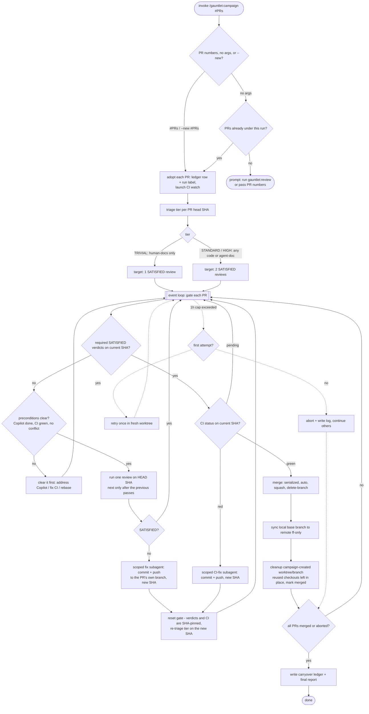

# Campaign

Part of the [gauntlet](../../README.md) plugin.

Point it at existing pull requests and it drives each one to merge: it re-reviews the PR against a
strict quality bar, waits for CI to go green, and merges — all on its own, hands-off. It doesn't go
hunting for problems and it doesn't write fixes from scratch; it **gates PRs that already exist**
(yours, or ones [`/gauntlet:review`](../review/SKILL.md) opened for you) and merges each only once it
clears the bar.

Think of it as an automated senior reviewer that follows through: it defends each PR through repeated
context-isolated review rounds, fixes up whatever review or CI turns up on the PR itself, waits for
CI, and ships.

## What it's good for

- Driving a batch of open pull requests to merge under one strict, repeatable quality gate.
- Following up on a `gauntlet:review` report — turning its confirmed findings (opened as PRs) into
  actual merged fixes.
- Gating agent-facing changes (a `SKILL.md`, `CLAUDE.md`, prompt or reference file) with the same
  two-pass rigor as source code — those never get the lighter docs-only treatment.

## How to use it

```
/gauntlet:campaign #12          # adopt PR #12 into a run, gate it, merge it
/gauntlet:campaign #12 #15      # adopt several PRs into one run
/gauntlet:campaign              # resume this run's PRs, or prompt if there's nothing to gate
/gauntlet:campaign --new #20    # start a fresh run for a new set of PRs
```

Give it one or more PR numbers and it **adopts** them into a run: it labels each PR so the run owns
it, classifies the change by the *kind* of files it touches — human-facing docs vs code vs
agent-consumed docs vs sensitive surfaces — to pick a review tier (the change's size never enters
into it), then starts gating. Run it **once** — it schedules its
own follow-ups and keeps working until every adopted PR is merged or set aside; you don't need to
keep it open or re-run it.

Run it plain, with no arguments, and it picks up the PRs already under this run and continues where
it left off. If there's nothing left to gate it doesn't invent work — it tells you so and points you
at `gauntlet:review` to find issues, or asks for PR numbers. There's no whole-repo sweep and no
area/topic argument any more: campaign gates PRs you hand it, it doesn't go looking for problems.

Where do the PRs come from? You open them, or `gauntlet:review` does. Run `gauntlet:review` first for
a confirmed-findings report; at the end it can open one PR per confirmed fix and hand them
straight to a campaign — see [the handoff below](#where-the-prs-come-from-the-review-handoff).

Come back later and it still does the sensible thing. `--run <id>` resumes a specific run; `--new`
(or just "start a fresh run") begins a fresh run over a new PR set — which is also how you
deliberately run two at once over different PRs. A fresh run isn't a blind redo: it remembers what
earlier runs learned (which PRs it gave up on, which it set aside as your call) so it doesn't
re-litigate the same ground.

## Where the PRs come from: the review handoff

Campaign gates PRs; it doesn't find the problems. [`/gauntlet:review`](../review/SKILL.md) is the
other half. Review runs its two-pass adversarial pass and, by default, only reports — it makes no
source/tracked-file or GitHub changes (it may write ephemeral `.gauntlet/tmp` review scratch). But at
the end of a confirmed-findings report it offers an opt-in step: open one pull request per
confirmed fix, then invoke `/gauntlet:campaign #PRs` on exactly those PRs. That handoff is where a
finding turns into code and a PR; campaign takes it from there and drives each PR to merge. Decline
the offer and review stays report-only — no source or GitHub changes are written. So the usual
progression is **`gauntlet:review` to find and confirm, then `gauntlet:campaign` to gate and merge**.
You can also skip review entirely and hand campaign PR numbers you opened yourself.

## What to expect

It drives each adopted PR to merge and merges it itself once the PR passes the reviews its tier
requires and CI is green. How many reviews depends on what the PR touches: a documentation-only PR
(human-facing prose alone) needs **one**; anything touching code or agent-facing files — source,
`SKILL.md`, `CLAUDE.md`, prompts, CI, scripts — always gets the full **two-pass** gate. (Two reviews
rather than one because a single stochastic review can miss a defect — not because two runs are
statistically independent; reading the same diff under the same review task makes their verdicts
correlated.) There's no approval step along the way, so starting it is your sign-off — and a run over
several PRs can keep going for a while before it's done.

The loop works on each PR in place: it reviews the PR's current HEAD and watches its CI. When a
review or CI failure needs fixing, a scoped subagent commits and pushes the fix onto the PR's **own**
branch — a new HEAD that resets the gate (verdicts and CI are pinned to a SHA). It never writes a fix
from scratch or opens a PR of its own; every change it makes is in service of getting an existing PR
through.

It also doesn't wait around. Everything long-running — reviews, CI watches, fix subagents — happens
in the background across all the adopted PRs at once, so at any moment it's doing all the work that's
ready to do.

You can follow along on GitHub: each PR is labeled `gauntlet-reviewing` while it's working through
the loop, and that flips to `gauntlet-accepted` once it has passed the review(s) its tier requires —
one for a TRIVIAL docs-only PR, two for anything touching code or agent-facing files (the skill
creates the labels if your repo doesn't have them).

By default it checks with you before changing anything in your public API — exported signatures,
formats, CLI flags, defaults, or any behavior callers depend on — so it never merges a breaking
change behind your back. Tell it up front that breakage is fine and it'll stop asking.

It tidies up as it goes: each merged PR's remote branch is deleted, and any worktree/local branch the
campaign itself created for that PR is removed — but a pre-existing checkout it merely reused (e.g. your
own branch already checked out) is left untouched. If a fix just can't clear the
bar, it retries once, then sets that one aside with a note on why and moves on rather than stalling
everything else. When it's finished you get a short rundown: what merged, what it gave up on, and
anything it left for you to weigh in on.

## Flow



## Good to know

- You can run more than one at a time in the same repo — say one gating PRs `#12 #13` and another
  gating `#20`. Each is its own isolated run with its own pull requests and bookkeeping, so they never
  step on each other; a PR already owned by one run's label won't be stolen by another. And if a run
  gets interrupted, another agent can pick it up right where it left
  off: it can tell a run that's still being actively driven from one that's been abandoned, so it only
  ever resumes an orphaned run and never doubles up on one already in progress.
- By default the reviewer is Claude's own subagents, so it runs with nothing extra installed. For a
  stronger gauntlet you can point it at a reviewer that runs a different agent/model than the
  orchestrator — Codex CLI (`codex exec`) is the recommended example, since an independent engine
  catches defects a same-model re-roll can miss. Name it when you invoke the campaign ("review with
  codex") or record it as your preferred reviewer (memory or `CLAUDE.md`). If an external reviewer
  can't return a verdict because of a system problem — quota or rate limits, auth, a timeout — it
  retries once and then falls back to its own subagents, so a transient outage slows a run down but
  doesn't stall it.
- It works through GitHub PRs via the `gh` CLI, so the repo needs a GitHub remote.
- Before it spends a review on a PR, it first clears anything that would waste one: it addresses any
  GitHub Copilot review comments, fixes failing CI, and rebases a PR that has fallen into conflict
  with the base branch — then reviews the clean result.
- It keeps a small `.gauntlet/history/` at the repo root (git-ignored, one file per run) to remember what past
  runs learned. That's the memory a fresh run carries over. Each fresh run also tidies that file,
  dropping entries that no longer apply to the current code — and when it isn't sure an entry is
  safe to drop, it asks you first rather than guessing.
- Full mechanics live in [`SKILL.md`](./SKILL.md) and [`references/`](./references/).
